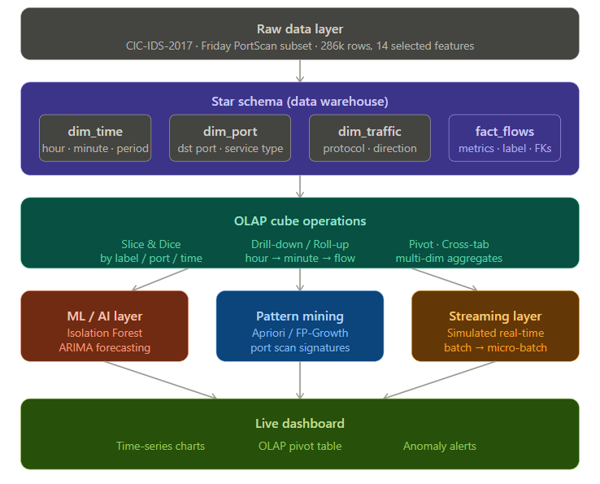

# cyber-olap-system
Time-Series OLAP System for Network Intrusion Analysis

Dataset
The project uses the CICIDS2017 (Friday-WorkingHours-Afternoon-PortScan subset)
The dataset contains network traffic flow records with features such as packet counts, flow duration, protocol details, and attack labels
A reduced and cleaned subset (~20,000 rows) is used for efficient processing and OLAP operations
Additional preprocessing and feature selection are applied to retain only relevant attributes

Aim of the Project
To design and implement a Time-Series OLAP system for analyzing network traffic data
To apply ETL (Extract, Transform, Load) techniques for transforming raw data into a structured data warehouse schema
To enable multidimensional analysis using OLAP operations such as roll-up, drill-down, slice, and dice
To identify patterns and trends in network behavior over time
To implement data mining techniques (anomaly detection) for detecting suspicious or malicious activities in the network

